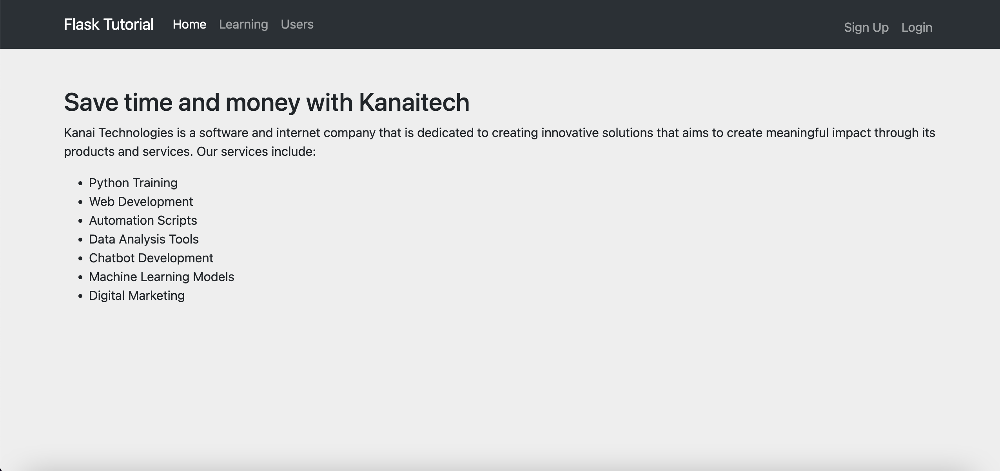
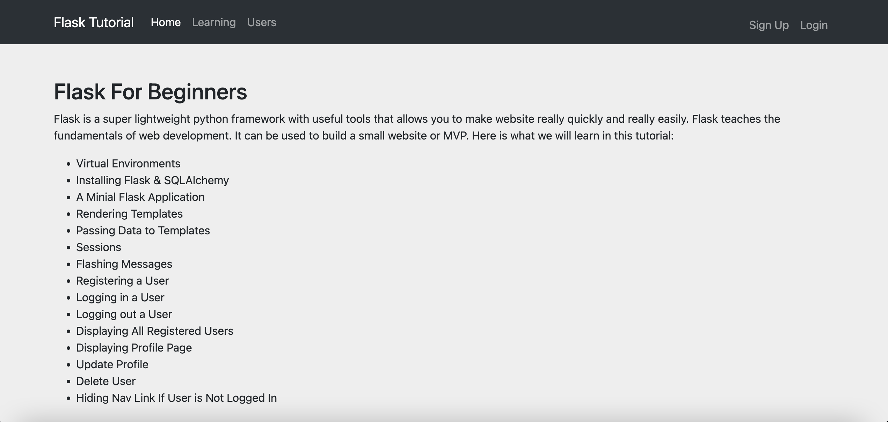
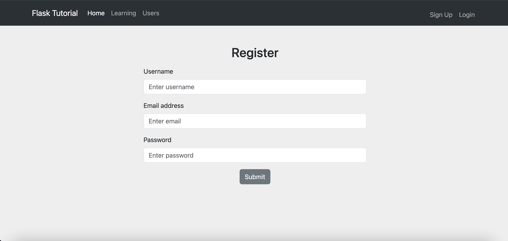
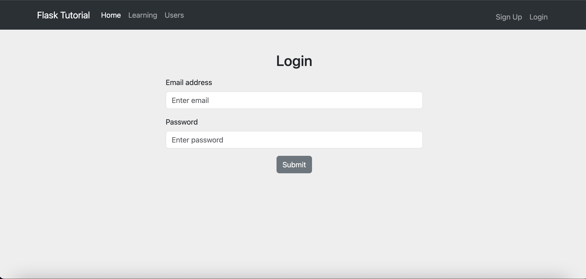
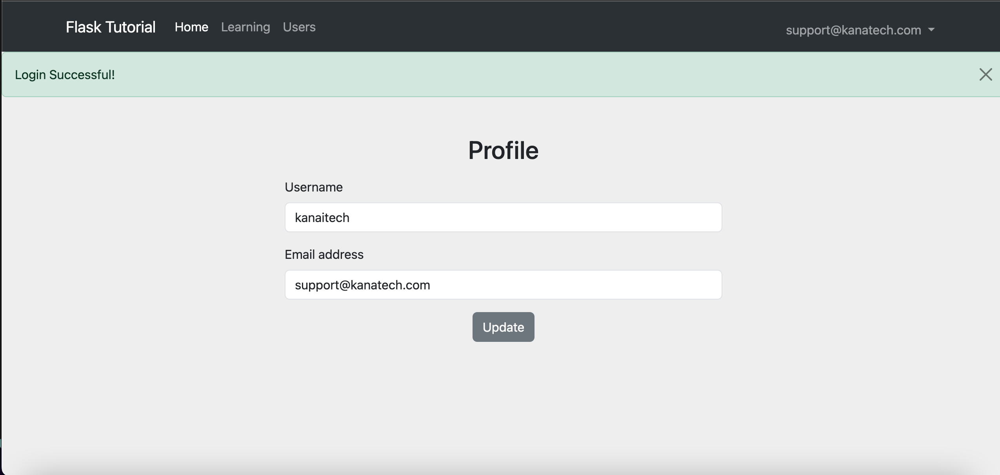

# Flask Beginner Tutorial

**What you'll learn:**
```
1. How to make a website with python
2. Rendering HTML templates
3. Add Bootstrap and Templates
4. HTTP Methods and Retrieving Form Data
5. Sessions
6. Message Flashing
7. Using SQLAlchemy Database
8. Adding, Deleting & Updating Users w/ SQLAlchemy
9. Importing Static Files (CSS, JS & Images)
10.Blueprints & Using Multiple Python Files
11.Deploying a Flask App to a Linux Server
```

**Requirements:**
```
1. flask
2. flask_sqlalchemy
```
<p>
  
</p>

<p>
  
</p>

<p>
  
</p>

<p>
  
</p>

<p>
  
</p>

## 1. How to Make Websites with Python

### Create an environment

Create a project folder and a .venv folder within:

**1. MacOS**

`$ mkdir myproject`

`$ cd myproject`

`$ python3 -m venv .venv`

**2. Windows**

`> mkdir myproject`

`> cd myproject`

`> py -3 -m venv .venv`

### Activate the environment

Before you work on your project, activate the corresponding environment:

**1. MacOS/Linux**

`$ . .venv/bin/activate`

**2. Windows**

`> .venv\Scripts\activate`

### Install Packages

Before you work on your project, activate the corresponding environment and install the following packages:

`$ pip install flask`

`$ pip install Flask-SQLAlchemy`

By default Flask will assume we running in production, we need to tell it we running in development:

`$ export FLASK_ENV=development`

Specify the module with our flask app, in our case 'app':

`export FLASK_APP=app`

### Run Flask

`$ flask run`

or 

`$ python app.py`

```
# how to build a website with flask
from flask import Flask, redirect, url_for

app = Flask(__name__)

@app.route('/')
def home():
    return "Hello world"

# passing a variable in a url
@app.route('/<name>')
def user(name):
    return f"Hello {name}!"

# redirect to the name of the function
@app.route('/admin')
def admin():
    return redirect(url_for("home"))

if __name__ == '__main__':
    app.run()
```

## 2. HTML Templates

```
# rendering data to the template
from flask import Flask, redirect, url_for, render_template

app = Flask(__name__)

@app.route('/')
def home():
    python_projects = ["Python Training", "Web Development", "Automation Scripts", "Data Analysis Tools", 
                       "Chatbot Development", "Machine Learning Models"]

    return render_template("index.html", projects=python_projects)

# learning page
@app.route('/learning')
def features():
    if "email" in session:
        email = session["email"]
    else:
        email = None

    return render_template("learning.html", email=email)


if __name__ == '__main__':
    app.run()
```

```
# templates/index.html
<!DOCTYPE html>
<html>
    <head>
        <title>Home page</title>
    </head>
    <body>
        <h1>Kanaitech</h1>
        <p>Hello, Welcome to our website. Our services include:</p>
        <ul>
            
                <li>{{ project }}</li>
            
        </ul>

        <p>Odd Numbers</p>
        
            {% if x % 2 == 1 %}
                <p>{{ x }}</p>
            
        
    </body>
</html>
```

## 3. Adding Bootstrap and Templates

```
# template inheritance
# templates/layout.html
<html>

<head>
    <meta charset="utf-8" />
    <meta name="viewport" content="width=device-width, initial-scale=1" />
    <title>Home</title>
    <link href="https://cdn.jsdelivr.net/npm/bootstrap@5.3.0/dist/css/bootstrap.min.css" rel="stylesheet"
        integrity="sha384-9ndCyUaIbzAi2FUVXJi0CjmCapSmO7SnpJef0486qhLnuZ2cdeRhO02iuK6FUUVM" crossorigin="anonymous">
    <link rel="stylesheet" type="text/css" href="{{ url_for('static', filename='css/style.css') }}">
</head>

<body>

    <nav class="navbar navbar-expand-lg bg-body-tertiary" data-bs-theme="dark">
        <div class="container">
            <a class="navbar-brand" href="/">Flask Tutorial</a>
            <button class="navbar-toggler" type="button" data-bs-toggle="collapse" data-bs-target="#navbarNavDropdown"
                aria-controls="navbarNavDropdown" aria-expanded="false" aria-label="Toggle navigation">
                <span class="navbar-toggler-icon"></span>
            </button>
            <div class="collapse navbar-collapse" id="navbarNavDropdown">
                <ul class="navbar-nav me-auto mb-2 mb-lg-0">
                    <li class="nav-item">
                        <a class="nav-link active" aria-current="page" href="/">Home</a>
                    </li>
                    <li class="nav-item">
                        <a class="nav-link" href="/learning">Learning</a>
                    </li>
                    <li class="nav-item">
                        <a class="nav-link" href="/users">Users</a>
                    </li>
                </ul>

                <ul class="navbar-nav my-2 mb-lg-0">
                    
                        <li class="nav-item dropdown">
                            <a class="nav-link dropdown-toggle" href="#" role="button" data-bs-toggle="dropdown"
                                aria-expanded="false">
                                {{ email }}
                            </a>
                            <ul class="dropdown-menu">
                                <li><a class="dropdown-item" href="/profile">Profile</a></li>
                                <li><a class="dropdown-item" id="logout" href="/logout">Logout</a></li>
                            </ul>
                        </li>
                    
                        <li class="nav-item">
                            <a class="nav-link" id="signUp" href="/register">Sign Up</a>
                        </li>
                        <li class="nav-item">
                            <a class="nav-link" id="signUp" href="/login">Login</a>
                        </li>
                    
                </ul>
            </div>
        </div>
    </nav>

    
          
              
                
                <div class="alert alert-danger alert-dismissible fade show" role="alert">
                    {{ message }}
                    <button type="button" class="btn-close" data-bs-dismiss="alert" aria-label="Close"></button>
                </div>
                
                <div class="alert alert-success alert-dismissible fade show" role="alert">
                    {{ message }}
                    <button type="button" class="btn-close" data-bs-dismiss="alert" aria-label="Close"></button>
                </div>
                
              
          
    

    <div class="container">
        
    </div>

    <script src="https://cdn.jsdelivr.net/npm/bootstrap@5.3.0/dist/js/bootstrap.bundle.min.js"
        integrity="sha384-geWF76RCwLtnZ8qwWowPQNguL3RmwHVBC9FhGdlKrxdiJJigb/j/68SIy3Te4Bkz"
        crossorigin="anonymous">
    </script>
    <script 
        type="text/javascript"
        src="{{ url_for('static', filename='index.js') }}">
    </script>
</body>

</html>
```

```
# templates/index.html


Welcome


    <h2 class="mt-3">Better digital experience with Kanaitech</h2>
    <p>
        Kanai Technologies is a software and internet company that is dedicated to creating innovative solutions 
        that prioritizes the needs and experienc of end-users. With a focus on leveraging technology to improve 
        the lives of individuals and businesses, Kanai Technologies aims to create meaningful impact through 
        its products and services. Our services include:
    </p>
    <ul>
        
            <li>{{ project }}</li>
        
    </ul>

```

```


Welcome


    <h2 class="mt-5">Flask For Beginners</h2>
    <!--  -->
    <p>
        Flask is a super lightweight python framework with useful tools that allows you to make website really quickly
        and really easily. Flask teaches the fundamentals of web development. It can be used to build a small website or MVP. 
        Here is what we will learn in this tutorial:
    </p>
    <ul>
        <li>Virtual Environments</li>
        <li>Installing Flask & SQLAlchemy</li>
        <li>A Minial Flask Application </li>
        <li>Rendering Templates </li>
        <li>Passing Data to Templates </li>
        <li>Sessions</li>
        <li>Flashing Messages</li>
        <li>Registering a User</li>
        <li>Logging in a User</li>
        <li>Logging out a User</li>
        <li>Displaying All Registered Users</li>
        <li>Displaying Profile Page</li>
        <li>Update Profile</li>
        <li>Delete User</li>
        <li>Hiding Nav Link If User is Not Logged In</li>
    </ul>

```

## 4. HTTP Methods (GET/POST) & Retrieving Form Data

Let's take a deep dive into the `login` route to understand how to handle **GET** and **POST** methods.

```
# how to build a website with flask
from flask import Flask, redirect, url_for, render_template, request

app = Flask(__name__)

@app.route('/')
def home():
    python_projects = ["Python Training", "Web Development", "Automation Scripts", 
                       "Data Analysis Tools", "Chatbot Development", 
                       "Machine Learning Models", "Digital Marketing"]
    return render_template("index.html", projects=python_projects)

# learning page
@app.route('/learning')
def features():
    if "email" in session:
        email = session["email"]
    else:
        email = None

    return render_template("learning.html", email=email)

# login page
@app.route('/login', methods=['POST', 'GET'])
def login():
    if request.method == "POST":
        email = request.form["email"]
        return redirect(url_for("user", email=email))
    else:
        return render_template("login.html")
    
# display user email
@app.route("/<email>")
def user(email):
    return f"<p><b>Email address:</b> {email}</p>"


if __name__ == '__main__':
    app.run(debug=True)
```

## 5. Sessions

Session are a way of temporarly storing data on the server and designed for quick access of information in a way to pass information around different pages of your website. Think of it as, a user logs in and given a session while the user is on the website and as soon as the user leaves the website, it's session is destroyed.

For example, when someone logs in on facebook or instagram, there's going to be a new session created. Its going to store the user information, probability what the user is doing on the website at the current time. As they go different pages, those pages can access that session data. As soon as the user leaves that page or logouts, all that session data is erased (disappears) and the next time the user visits the website, that data will be reloaded into the session.

`>>> from flask import session`

```
# how to build a website with flask
from flask import Flask, redirect, url_for, render_template, request, session
from datetime import timedelta

app = Flask(__name__)
app.secret_key = "ktech20"
app.permanent_session_lifetime = timedelta(minutes=30)
# app.permanent_session_lifetime = timedelta(days=30)

@app.route('/')
def home():
    python_projects = ["Python Training", "Web Development", "Automation Scripts", 
                       "Data Analysis Tools", "Chatbot Development", 
                       "Machine Learning Models", "Digital Marketing"]
    return render_template("index.html", projects=python_projects)
    
# display user email
@app.route('/user')
def user():
    if "email" in session:
        email = session["email"]
        return f"<p><b>Email address:</b> {email}</p>"
    else:
        return redirect(url_for("login"))

# login page
@app.route('/login', methods=['POST', 'GET'])
def login():
    if request.method == "POST":
        # get variables
        email = request.form["email"]
        # generate session
        session["email"] = email
        return redirect(url_for("user"))
    else:
        if "email" in session:
            return redirect(url_for("user"))
        return render_template("login.html")
    
# logout
@app.route('/logout')
def logout():
    session.pop("email", None)
    return redirect(url_for("login"))


if __name__ == '__main__':
    app.run(debug=True)
```

## 6. Message Flashing

`>>> from flask import flash`

```
# how to build a website with flask
from flask import Flask, redirect, url_for, render_template, request, session, flash
from datetime import timedelta

app = Flask(__name__)
app.secret_key = "ktech20"
app.permanent_session_lifetime = timedelta(minutes=30)
# app.permanent_session_lifetime = timedelta(days=30)

@app.route('/')
def home():
    python_projects = ["Python Training", "Web Development", "Automation Scripts", 
                       "Data Analysis Tools", "Chatbot Development", 
                       "Machine Learning Models", "Digital Marketing"]
    return render_template("index.html", projects=python_projects)
    
# display user email
@app.route('/user')
def user():
    if "email" in session:
        email = session["email"]
        return render_template("user.html", email=email)
    else:
        return redirect(url_for("login"))

# login page
@app.route('/login', methods=['POST', 'GET'])
def login():
    if request.method == "POST":
        session.permanent = True # increase timeout session to line 7
        # get variable values from form
        email = request.form["email"]
        # generate session
        session["email"] = email
        flash("Login Successful!")
        return redirect(url_for("user"))
    else:
        if "email" in session:
            flash("Already Logged In!")
            return redirect(url_for("user"))
        
        return render_template("login.html")
    
# logout
@app.route('/logout')
def logout():
    flash("You have been logged out!", "info")
    # pop out email session
    session.pop("email", None)
    return redirect(url_for("login"))


if __name__ == '__main__':
    app.run(debug=True)
```

## 7. Using SQLAlchemy Database

`>>> from flask_sqlalchemy import SQLAlchemy`

`>>> app.config['SQLALCHEMY_DATABASE_URI'] = 'sqlite:///users.sqlite3'`

`>>> app.config['SQLALCHEMY_TRACK_MODIFICATIONS'] = False # optional`

`>>> db = SQLAlchemy(app)`

`>>> db.create_all()`


```
# how to build a website with flask
from flask import Flask, redirect, url_for, render_template, request, session, flash
from datetime import timedelta
from flask_sqlalchemy import SQLAlchemy

app = Flask(__name__)
app.secret_key = "ktech20"
app.config['SQLALCHEMY_DATABASE_URI'] = 'sqlite:///users.sqlite3'
app.config['SQLALCHEMY_TRACK_MODIFICATIONS'] = False # optional
app.permanent_session_lifetime = timedelta(minutes=30)
# app.permanent_session_lifetime = timedelta(days=30)

db = SQLAlchemy(app)

class users(db.Model):
    _id = db.Column("id", db.Integer, primary_key=True)
    name = db.Column(db.String(100))
    email = db.Column(db.String(100))

    def __init__(self, name, email):
        self.name = name
        self.email = email


@app.route('/')
def home():
    python_projects = ["Python Training", "Web Development", "Automation Scripts", 
                       "Data Analysis Tools", "Chatbot Development", 
                       "Machine Learning Models", "Digital Marketing"]
    return render_template("index.html", projects=python_projects)
    
# display user email
@app.route('/profile', method=["POST", "GET"])
def profile():
    username = None
    if "email" in session:
        email = session["email"]

        if request.method == "POST":
            username = request.form["username"]
            session["username"] = username
            flash("Email was saved!")
        else:
            if "username" in session:
                username = session["username"]
        
        return render_template("profile.html", username=username)
    else:
        flash("You are not logged in!")
        return redirect(url_for("login"))

# login page
@app.route('/login', methods=['POST', 'GET'])
def login():
    if request.method == "POST":
        session.permanent = True # increase timeout session to line 7
        # get variable values from form
        email = request.form["email"]
        # generate session
        session["email"] = email
        flash("Login Successful!")
        return redirect(url_for("user"))
    else:
        if "email" in session:
            flash("Already Logged In!")
            return redirect(url_for("user"))
        
        return render_template("login.html")
    
# logout
@app.route('/logout')
def logout():
    flash("You have been logged out!", "info")
    # pop out email session
    session.pop("username", None)
    session.pop("email", None)
    return redirect(url_for("login"))


if __name__ == '__main__':
    db.create_all()
    app.run(debug=True)
```

## 8. Adding, Deleting & Updating Users w/ SQLAlchemy

```
# how to build a website with flask
from flask import Flask, redirect, url_for, render_template, request, session, flash
from datetime import timedelta
from flask_sqlalchemy import SQLAlchemy

app = Flask(__name__)
app.secret_key = "ktech20"
# configure the SQLite database, relative to the app instance folder
app.config["SQLALCHEMY_DATABASE_URI"] = "sqlite:///user.db"
app.config['SQLALCHEMY_TRACK_MODIFICATIONS'] = False # optional
app.permanent_session_lifetime = timedelta(minutes=30)
# app.permanent_session_lifetime = timedelta(days=30)

db = SQLAlchemy(app)
# initialize the app with the extension
# db.init_app(app)

class User(db.Model):
    id = db.Column(db.Integer, primary_key=True)
    username = db.Column(db.String(80), unique=True, nullable=False)
    email = db.Column(db.String(120), unique=True, nullable=False)

    def __init__(self, username, email):
        self.username = username
        self.email = email


with app.app_context():
    db.create_all()

# welcome page
@app.route('/')
def home():
    python_projects = ["Python Training", "Web Development", "Automation Scripts", 
                       "Data Analysis Tools", "Chatbot Development", 
                       "Machine Learning Models", "Digital Marketing"]
    return render_template("index.html", projects=python_projects)

# login page
@app.route('/login', methods=['POST', 'GET'])
def login():
    if request.method == "POST":
        session.permanent = True # increase timeout session to line 7
        # get variable values from form
        email = request.form["email"]
        # generate session
        session["email"] = email

        if User.query.filter_by(email=email).first() is not None:
            flash("Login Successful!")
            return redirect(url_for("profile"))
            # return render_template("profile.html", username=username, email=email)
    else:
        if "email" in session:
            flash("Already Logged In!")
            return redirect(url_for("profile"))
        
        return render_template("login.html")

# login page
@app.route('/register', methods=['POST', 'GET'])
def register():
    # create account with POST
    if request.method == "POST":
        session.permanent = True # increase timeout session to line 7
        # get variable values from form
        email = request.form["email"]
        username = request.form["username"]
        # password = request.form["password"]

        # validation
        if User.query.filter_by(email=email).first() is not None:
            flash("Email is taken!", category='error')
            return redirect(url_for("login"))
    
        if User.query.filter_by(username=username).first() is not None:
            flash("Username is taken!", category='error')
            return redirect(url_for("login"))
    
        # pwd_hash = generate_password_hash(password)

        # check if user exists and add user
        user = User.query.filter_by(email=email).first()
        if user:
            # generate sessions
            session["email"] = user.emai
            session["username"] = user.username
        else:
            # add new user
            user = User(username=username, email=email)
            db.session.add(user)
            db.session.commit()

        flash("Account Created Successful!")
        return redirect(url_for("profile"))
    
    # GET registration form
    else:
        if "email" in session:
            flash("Already Logged In!")
            return redirect(url_for("profile"))
        
        return render_template("register.html")
    
# logout
@app.route('/logout')
def logout():
    flash("You have been logged out!", category='error')
    # pop out email session
    session.pop("username", None)
    session.pop("email", None)
    return redirect(url_for("login"))

# display user profile
@app.route('/profile', methods=["POST", "GET"])
def profile():

    if "email" in session:
        # retrieve email from session
        email = session["email"]

        # fetch user from database by email
        user = User.query.filter_by(email=email).first()

        if request.method == "POST":
            email = request.form["email"]
            username = request.form["username"]

            user.username = username
            user.email = email
            db.session.commit()
            # flash success message
            flash("Profile updated!", category='success')
        else:
            if "email" in session:
                email = session["email"]
            if "usename" in session:
                usename = session["username"]

        return render_template("profile.html", email=email, username=user.username)
    else:
        flash("You are not logged in!")
        return redirect(url_for("login"))


# users list
@app.route('/users')
def users():
    return render_template("users.html", users=User.query.all())

# delete user
@app.route('/users/delete/<int:user_id>')
def delete_user(user_id):
    user = User.query.filter_by(id=user_id).first()
    user.delete()
    db.session.commit()
    return redirect(url_for("login"))

if __name__ == '__main__':
    # db.create_all()
    app.run(debug=True)

```

## 9. Static Files (Custom CSS, Image & JavaScript)

### 9.1 Import CSS & JS Files

```
# import css and js files in layout template
<html>

<head>
    <meta charset="utf-8" />
    <meta name="viewport" content="width=device-width, initial-scale=1" />
    <title>Home</title>
    <link href="https://cdn.jsdelivr.net/npm/bootstrap@5.3.0/dist/css/bootstrap.min.css" rel="stylesheet"
        integrity="sha384-9ndCyUaIbzAi2FUVXJi0CjmCapSmO7SnpJef0486qhLnuZ2cdeRhO02iuK6FUUVM" crossorigin="anonymous">
    # 1. import custom css stylesheets
    <link rel="stylesheet" type="text/css" href="{{ url_for('static', filename='css/style.css') }}">
</head>

<body>

    <nav class="navbar navbar-expand-lg bg-body-tertiary">
        <div class="container-fluid">
            <a class="navbar-brand" href="/">Kanaitech</a>
            <button class="navbar-toggler" type="button" data-bs-toggle="collapse" data-bs-target="#navbarNavDropdown"
                aria-controls="navbarNavDropdown" aria-expanded="false" aria-label="Toggle navigation">
                <span class="navbar-toggler-icon"></span>
            </button>
            <div class="collapse navbar-collapse" id="navbarNavDropdown">
                <ul class="navbar-nav">
                    <li class="nav-item">
                        <a class="nav-link active" aria-current="page" href="/">Home</a>
                    </li>
                    <!-- <li class="nav-item">
                        <a class="nav-link" href="#">Features</a>
                    </li> -->
                    <li class="nav-item">
                        <a class="nav-link" id="signUp" href="/register">Sign Up</a>
                    </li>
                    <li class="nav-item dropdown">
                        <a class="nav-link dropdown-toggle" href="#" role="button" data-bs-toggle="dropdown"
                            aria-expanded="false">
                            Account
                        </a>
                        <ul class="dropdown-menu">
                            <!-- <li><a class="dropdown-item" href="#">Profile</a></li> -->
                            <li><a class="dropdown-item" id="login" href="/login">Login</a></li>
                            <li><a class="dropdown-item" id="logout" href="/logout">Logout</a></li>
                        </ul>
                    </li>
                </ul>
            </div>
        </div>
    </nav>

    
          
              
                
                <div class="alert alert-danger alert-dismissible fade show" role="alert">
                    {{ message }}
                    <button type="button" class="btn-close" data-bs-dismiss="alert" aria-label="Close"></button>
                </div>
                
                <div class="alert alert-success alert-dismissible fade show" role="alert">
                    {{ message }}
                    <button type="button" class="btn-close" data-bs-dismiss="alert" aria-label="Close"></button>
                </div>
                
              
          
    

    <div class="container">
        
    </div>

    <script src="https://cdn.jsdelivr.net/npm/bootstrap@5.3.0/dist/js/bootstrap.bundle.min.js"
        integrity="sha384-geWF76RCwLtnZ8qwWowPQNguL3RmwHVBC9FhGdlKrxdiJJigb/j/68SIy3Te4Bkz"
        crossorigin="anonymous">
    </script>
    
    # 2. import custom js files
    <script 
        type="text/javascript"
        src="{{ url_for('static', filename='index.js') }}">
    </script>
</body>

</html>
```

### 9.2 Display image in home page

```


Welcome


    <h2 class="mt-3">Better digital experience with Kanaitech</h2>
    <!--  -->
    <p>
        Kanai Technologies is a software and internet company that is dedicated to creating innovative solutions that
        aims to create meaningful impact through its products and services. Our services include:
    </p>
    <ul>
        
            <li>{{ project }}</li>
        
    </ul>

```

## 10. Blueprints & Using Multiple Python Files

### 10.1 App File (main.py)

```
# main.py
from flask import Flask, render_template
from auth import auth

app = Flask(__name__)

# register blueprint
app.register_blueprint(auth, user_prefix="/auth")

@app.route()
def test():
    return "<h1>Test page</h2>"

if __name__ == '__main__':
    app.run(debug=True)
```

### 10.2 Authentication Blueprint (auth.py)

```
# auth.py
from flask import Blueprint, render_template

auth = Blueprint("auth", __name__, static_folder="static", template_folder="templates")

@auth.route("/login")
def login():
    return render_template("login.html")
```

## 11. How to Deploy a Flask App to a Linux Server

# References

1. [Flask Tutorials - Tech With Tim](https://www.youtube.com/watch?v=mqhxxeeTbu0&list=PLzMcBGfZo4-n4vJJybUVV3Un_NFS5EOgX)
2. [Understanding Blueprints](http://exploreflask.com/en/latest/blueprints.html)
3. [Blueprint & Multiple Python Files - Youtube Tutorial](https://www.youtube.com/watch?v=WteIH6J9v64&list=PLzMcBGfZo4-n4vJJybUVV3Un_NFS5EOgX&index=10)
3. [How to Deploy a Flask App to a Linux Server - Youtube Tutorial](https://www.youtube.com/watch?v=YFBRVJPhDGY&list=PLzMcBGfZo4-n4vJJybUVV3Un_NFS5EOgX&index=12)